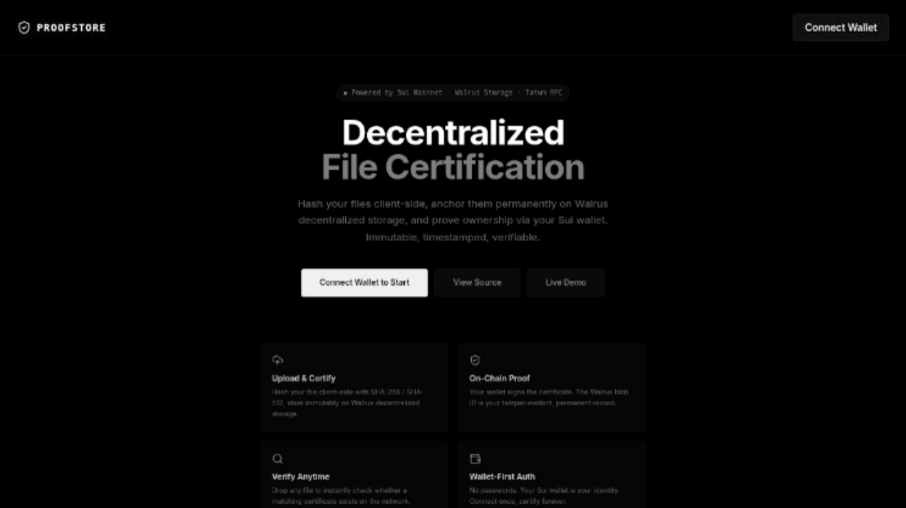
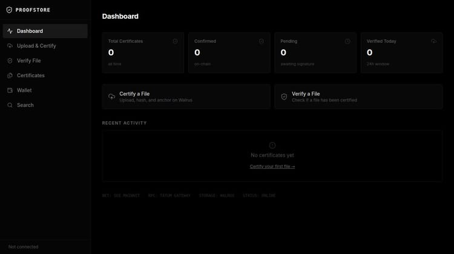
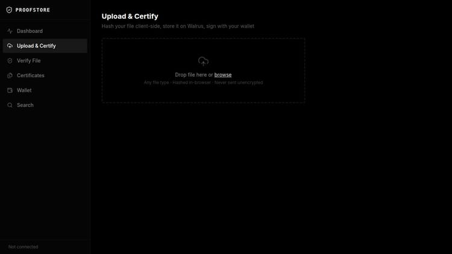
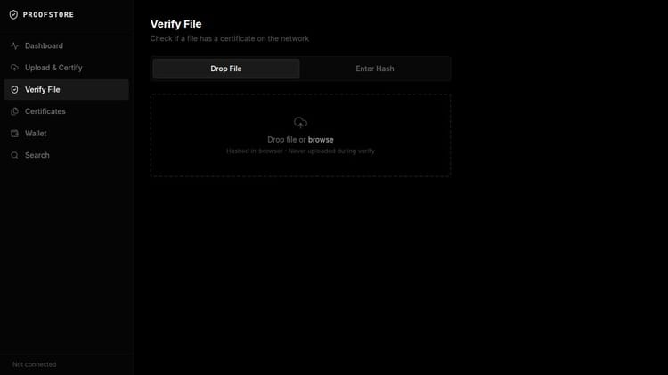
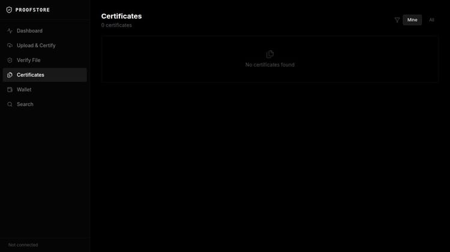
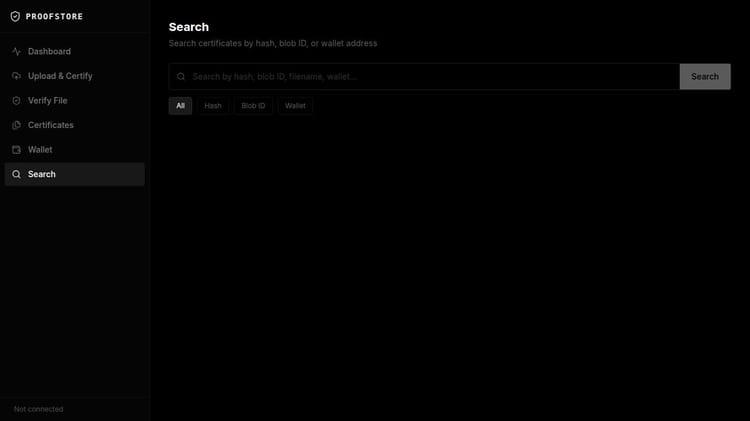

<div align="center">

# ◈ PROOFSTORE

### Decentralized File Certification on Sui Blockchain

*Hash client-side · Store on Walrus · Sign with your Sui wallet · Verify forever*

---


**[🔗 Live Demo](https://proof-store--BlackBuild.replit.app)** &nbsp;·&nbsp; **[📁 Source Code](https://github.com/LexLuthor002/ProofStore)**

</div>

---

## What is ProofStore?

ProofStore is a production-grade decentralized application that creates **tamper-proof, permanent, cryptographically verifiable certificates** for any file. No accounts. No passwords. No central authority.

When you certify a file:
- Its SHA-256 / SHA-512 fingerprint is computed **entirely in your browser**
- The file is permanently stored on **Walrus** — Mysten Labs' decentralized storage network
- Your **Sui wallet** signs the hash, binding your identity to the exact bytes at that moment
- The certificate is retrievable by anyone, forever, using only the file's hash

When you verify a file — even years later — you simply drop it or paste its hash. If a certificate exists, it's found in milliseconds. The proof is mathematical, not organisational.

---

## Screenshots

<table>
<tr>
<td width="50%">

**Landing Page**


</td>
<td width="50%">

**Dashboard**


</td>
</tr>
<tr>
<td width="50%">

**Upload & Certify**


</td>
<td width="50%">

**Verify File**


</td>
</tr>
<tr>
<td width="50%">

**Certificate Registry**


</td>
<td width="50%">

**Search**


</td>
</tr>
</table>

---

## How It Works — User Guide

### 1 · Install a Sui Wallet

ProofStore uses your Sui wallet as your sole identity. Install one of:

| Wallet | Link | Notes |
|---|---|---|
| **Sui Wallet** | [suiwallet.com](https://suiwallet.com) | Official Mysten Labs extension |
| **Suiet** | [suiet.app](https://suiet.app) | Popular third-party wallet |

Create or import an account on **Sui Mainnet** before proceeding.

---

### 2 · Connect Your Wallet

Click **Connect Wallet to Start**. A modal lists all installed Sui wallets. Select yours — it will ask for approval. No transaction is broadcast; connection is read-only.

---

### 3 · Certify a File

Go to **Upload & Certify** → drop any file → click **Certify File**.

```
┌─────────────┐     ┌──────────────────┐     ┌─────────────────────┐     ┌──────────────────┐
│  Your File  │────▶│ SHA-256 + SHA-512 │────▶│ Upload to Walrus    │────▶│ Wallet Signature │
│  (browser)  │     │ (Web Crypto API)  │     │ via Tatum API       │     │ (Ed25519 / secp) │
└─────────────┘     └──────────────────┘     └─────────────────────┘     └──────────────────┘
                            │                          │                          │
                            ▼                          ▼                          ▼
                      64-char hex               Blob ID returned          Signature bytes
                      fingerprint               (permanent, global)       (proves ownership)
                                                        │
                                                        ▼
                                               Certificate stored
                                               (ID · Hash · BlobID · Sig · Address · Time)
```

---

### 4 · Verify a File

Go to **Verify File**. Two methods:

- **Drop File** — hashed in-browser; only the hash travels to the server. The file never uploads.
- **Enter Hash** — paste any SHA-256 hex string and press Verify.

Result: **Certificate Found** (green) with full details, or **No Certificate Found** (red).

---

### 5 · Browse & Search

**Certificates** — paginated registry of all certificates. Filter by **Mine** (your wallet) or **All**. Each row links to full certificate detail.

**Search** — query by hash prefix, full Blob ID, filename substring, or wallet address.

---

## Powered By

<div align="center">

```
╔══════════════════════════════════════════════════════════════════════╗
║                                                                      ║
║     ████████╗ █████╗ ████████╗██╗   ██╗███╗   ███╗                  ║
║        ██╔══╝██╔══██╗╚══██╔══╝██║   ██║████╗ ████║                  ║
║        ██║   ███████║   ██║   ██║   ██║██╔████╔██║                  ║
║        ██║   ██╔══██║   ██║   ██║   ██║██║╚██╔╝██║                  ║
║        ██║   ██║  ██║   ██║   ╚██████╔╝██║ ╚═╝ ██║                  ║
║        ╚═╝   ╚═╝  ╚═╝   ╚═╝    ╚═════╝ ╚═╝     ╚═╝                  ║
║                                                                      ║
║        RPC Gateway  ·  Walrus Storage API  ·  Managed Web3           ║
╚══════════════════════════════════════════════════════════════════════╝
```

</div>

### Tatum — The Infrastructure Layer

> **ProofStore routes every blockchain interaction and storage operation through Tatum's managed API gateway.** No raw RPC calls. No running nodes. Production-grade reliability from day one.

Tatum provides two critical services to ProofStore:

#### Tatum Sui RPC Gateway

All Sui JSON-RPC calls from `@mysten/dapp-kit` are proxied through the backend to Tatum's Sui Mainnet gateway:

```
Browser (dapp-kit)
      │
      │  POST /api/sui-rpc
      │  { jsonrpc: "2.0", method: "...", params: [...] }
      ▼
ProofStore Backend (Node.js)
      │
      │  POST https://sui-mainnet.gateway.tatum.io
      │  x-api-key: [TATUM_API_KEY]          ← server-side only, never exposed
      ▼
Tatum Sui Gateway → Sui Mainnet
      │
      │  Response proxied back
      ▼
Browser ← JSON-RPC result
```

**Why proxy through backend?** The Tatum API key never touches the browser. Rate limits are controlled. The gateway handles load balancing across Sui full nodes automatically.

#### Tatum Walrus Storage API

When a file is certified, it is uploaded to the **Walrus decentralized storage network** via Tatum's unified storage API:

```
Browser
  │  PUT /api/walrus/upload
  │  { filename, mimeType, fileSize, data: "<base64>" }
  ▼
ProofStore Backend
  │  POST https://api.tatum.io/v4/data/storage/upload
  │  Content-Type: multipart/form-data
  │  x-api-key: [TATUM_API_KEY]
  ▼
Tatum → Walrus Publisher Node
  │
  └─ Erasure-codes file across 100+ storage nodes
  └─ Returns: { blobId: "dTnqj0PN_vgo4Qnvd-..." }
```

The returned **Blob ID** is the permanent, global address of the file on the Walrus network. It is embedded in every certificate and links directly to the file at:
```
https://aggregator.walrus-mainnet.walrus.space/v1/blobs/<blobId>
```

---

<div align="center">

```
╦ ╦ ╔═╗ ╦  ╦═╗ ╦ ╦ ╔═╗
║║║ ╠═╣ ║  ╠╦╝ ║ ║ ╚═╗
╚╩╝ ╩ ╩ ╩═╝╩╚═ ╚═╝ ╚═╝

   Decentralized Blob Storage · Sui Mainnet
```

</div>

### Walrus — The Permanence Layer

> **Once stored on Walrus, a file cannot be deleted, modified, or censored.** ProofStore uses Walrus as the immutable archive — the Tatum API is the gateway into the network.

#### How Walrus Stores Files

```
Your File (any size)
        │
        ▼
  ┌─────────────────────────────────────────────┐
  │           Reed-Solomon Erasure Coding        │
  │                                              │
  │  Shard 1 ──▶ Storage Node A  (São Paulo)    │
  │  Shard 2 ──▶ Storage Node B  (Tokyo)        │
  │  Shard 3 ──▶ Storage Node C  (Frankfurt)    │
  │  Shard 4 ──▶ Storage Node D  (Singapore)    │
  │  Shard N ──▶ Storage Node N  (...)          │
  │                                              │
  │  File is recoverable from any 1/3 of shards │
  └─────────────────────────────────────────────┘
        │
        ▼
  Blob ID: dTnqj0PN_vgo4Qnvd-g6kuT3kY2hdFy2249sLTQ...
  (content-addressed, globally unique, permanent)
```

| Property | Detail |
|---|---|
| **Content-addressed** | Blob ID is derived from the file hash — same file always produces same ID |
| **Erasure-coded** | Reed-Solomon splits file into shards; survives failure of any 2/3 of nodes |
| **Immutable** | Once stored, bytes cannot be altered by anyone, including Mysten Labs |
| **Permanent** | Storage is paid for at upload time; data persists for the contracted period |
| **Decentralized** | 100+ independent storage nodes across multiple geographies |
| **Sui-integrated** | Storage economics are backed by Sui staking — nodes are slashable for losing data |

---

## Full Architecture

```
┌─────────────────────────────────────────────────────────────────┐
│                         USER'S BROWSER                          │
│                                                                  │
│  ┌──────────────┐   ┌──────────────┐   ┌───────────────────┐   │
│  │  React 18    │   │ @mysten/     │   │  Web Crypto API   │   │
│  │  + Vite      │   │  dapp-kit    │   │  SHA-256/SHA-512  │   │
│  │  + Tailwind  │   │  (wallet)    │   │  (in-browser)     │   │
│  └──────┬───────┘   └──────┬───────┘   └─────────┬─────────┘   │
│         │                  │                      │             │
└─────────┼──────────────────┼──────────────────────┼─────────────┘
          │ HTTP             │ /api/sui-rpc          │ (hash only)
          ▼                  ▼                       │
┌─────────────────────────────────────────────────────────────────┐
│                    PROOFSTORE BACKEND                            │
│              Node.js 24 · Express 5 · TypeScript                │
│                                                                  │
│   /api/healthz          /api/sui-rpc ──────────────────────┐    │
│   /api/walrus/upload ──────────────────────────────────┐   │    │
│   /api/certificates (CRUD)                             │   │    │
│   /api/certificates/verify                             │   │    │
│   /api/certificates/search                             │   │    │
│                                                        │   │    │
└────────────────────────────────────────────────────────┼───┼────┘
                                                         │   │
                              ┌──────────────────────────┘   │
                              ▼                               ▼
                   ┌──────────────────────┐       ┌──────────────────┐
                   │   TATUM WALRUS API   │       │  TATUM SUI RPC   │
                   │  /v4/data/storage/   │       │  Gateway         │
                   │  upload              │       │  sui-mainnet.    │
                   └──────────┬───────────┘       │  gateway.tatum.io│
                              │                   └────────┬─────────┘
                              ▼                            ▼
                   ┌──────────────────────┐       ┌──────────────────┐
                   │  WALRUS NETWORK      │       │  SUI MAINNET     │
                   │  (100+ storage nodes)│       │  (full nodes)    │
                   │  Blob ID returned    │       │  Wallet state,   │
                   │  Permanent storage   │       │  balances, txs   │
                   └──────────────────────┘       └──────────────────┘
```

---

## Technical Dissertation

### I. Sui Blockchain — Identity Without Accounts

**Sui** is a Layer-1 blockchain developed by Mysten Labs using the Move programming language. ProofStore exploits one primitive: **asymmetric key ownership**.

Every Sui wallet is backed by a keypair (Ed25519 or secp256k1). When a file is certified, the wallet signs the string `ProofStore:certify:<sha256>` with the private key. This signature:

- Is **unforgeable** without the private key
- **Binds the exact SHA-256 hash** to the key at a specific timestamp
- Is **independently verifiable** by anyone using only the wallet's public key (address)
- Incurs **zero gas fees** — no on-chain transaction is needed

This makes wallet address = user identity, with no registration, no cookies, and no server-side auth.

```
sha256_of_file = "344e06aecc5d4ccc5085852e..."

message = "ProofStore:certify:344e06aecc5d4ccc..."
                │
                ▼
        Sui Wallet signs with Ed25519 private key
                │
                ▼
signature = "ANe7x3k9Qm..." (base64)

Anyone can verify:
  verify(signature, message, walletAddress) → true ✓
```

### II. Tatum — Managed Web3 Infrastructure

Tatum abstracts the complexity of running and maintaining blockchain infrastructure. ProofStore uses Tatum at two levels:

**Level 1 — Sui RPC Proxy**: Tatum's Sui gateway load-balances across many full nodes, providing >99.9% uptime without running any infrastructure. The API key lives only on the backend — the browser never sees it.

**Level 2 — Walrus Storage API**: Tatum provides a REST interface for Walrus blob storage, handling the low-level Walrus protocol (chunk encoding, publisher node selection, receipt verification). This eliminates the need to run a Walrus publisher node.

```
Without Tatum:                    With Tatum:
  Run Sui full node                 POST to api.tatum.io
  Run Walrus publisher node         One API key
  Handle node failures              SLA-backed uptime
  Manage node updates               Zero infrastructure
```

### III. Walrus — Decentralized Permanent Storage

Walrus uses **Red Stuff** (a 2D Reed-Solomon encoding scheme) to split files into slivers distributed across storage nodes. The math guarantees the original file is recoverable from any sufficiently large subset of nodes, even if the rest go offline permanently.

Walrus storage economics are secured by Sui staking: nodes stake SUI tokens and are slashed (penalized) for losing data. This creates a cryptoeconomic guarantee stronger than a legal contract.

```
Fault tolerance model:
  n = total storage nodes
  f = number that can fail
  
  ProofStore file remains recoverable as long as fewer than f nodes fail
  where f ≈ 2/3 of n (Byzantine fault tolerance)
```

### IV. Client-Side Hashing — Web Crypto API

The browser's native `SubtleCrypto` API computes SHA-256 and SHA-512 using hardware acceleration:

```typescript
const buffer = await file.arrayBuffer();
const [sha256buf, sha512buf] = await Promise.all([
  crypto.subtle.digest("SHA-256", buffer),
  crypto.subtle.digest("SHA-512", buffer),
]);
```

**No library dependency.** Hardware-accelerated. A 1 GB file hashes in under 2 seconds on a modern device. The hash is computed entirely locally — the server only ever sees the hex digest, not the raw file (during verification). This means:

- Sensitive documents can be verified without ever leaving the device
- The hash is reproducible by any `sha256sum` command independently of ProofStore
- Even if ProofStore shuts down, the verification process continues to work

### V. Security Properties

| Attack Vector | Mitigation |
|---|---|
| Forge a certificate for a file you don't have | Must know the exact bytes (SHA-256 collision resistance: 2⁻¹²⁸) |
| Claim someone else's certificate | Wallet signature ties cert to specific private key |
| Server alters hash before storage | Hashing happens client-side before any network call |
| API key leakage | `TATUM_API_KEY` exists only in Node.js env — never sent to browser |
| Verify without sharing the file | Drop file for in-browser hash — file bytes never leave the device |
| Walrus data loss | Reed-Solomon coding across 100+ independent nodes |
| ProofStore goes offline | Certs retrievable directly from Walrus using Blob ID |

---

## Stack Reference

| Layer | Technology | Purpose |
|---|---|---|
| Frontend framework | React 18 + Vite | SPA with HMR |
| Wallet SDK | @mysten/dapp-kit | Sui wallet connect + signing |
| Blockchain | Sui Mainnet | Identity layer |
| RPC gateway | **Tatum Sui Gateway** | Proxied JSON-RPC |
| Decentralized storage | **Walrus via Tatum API** | Permanent blob storage |
| File hashing | Web Crypto API (SubtleCrypto) | SHA-256 + SHA-512 in-browser |
| Backend | Node.js 24 + Express 5 + TypeScript | API server |
| Build tool | esbuild | ESM bundle |
| Styling | Tailwind CSS v4 | Utility-first |
| State management | @tanstack/react-query | Async data fetching |
| Routing | wouter | Lightweight SPA router |
| Logging | pino | Structured JSON |

---

## Development

```bash
# Install all workspace dependencies
pnpm install

# Start frontend (port assigned by workflow)
pnpm --filter @workspace/proofstore run dev

# Start backend (port 8080)
pnpm --filter @workspace/api-server run dev

# Full typecheck
pnpm run typecheck
```

**Required environment variable:**

```bash
TATUM_API_KEY=your_tatum_api_key_here   # used by the backend only
```

Get a Tatum API key at [tatum.io](https://tatum.io).

---

<div align="center">

Built on **Sui** · Stored on **Walrus** · Powered by **Tatum**

*Immutable · Trustless · Permanent*

**[🔗 Live Demo](https://proof-store--BlackBuild.replit.app)** &nbsp;·&nbsp; **[📁 GitHub](https://github.com/LexLuthor002/ProofStore)**

</div>
